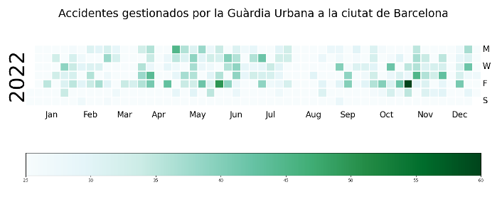
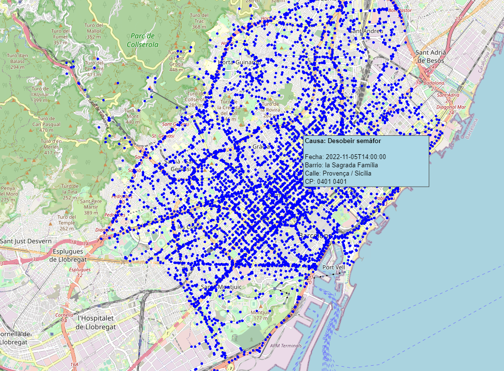
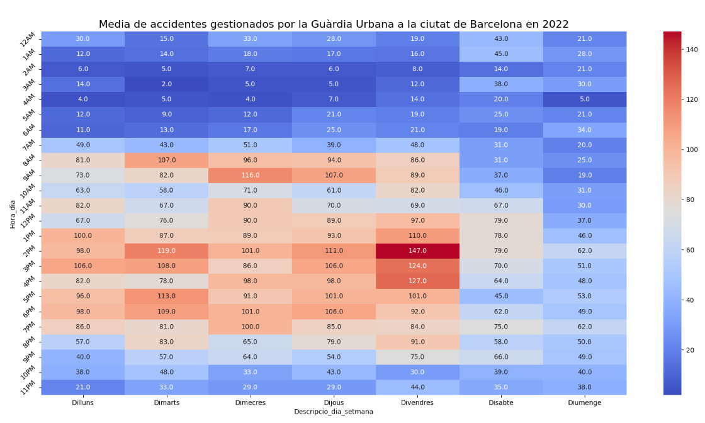

# Modelización y Visualización
## Práctica 1 : Visualización de Datos

### Instalar librerias
Instalar **librerias** necesarias para la ejecución del proyecto. 
```
$ pip install -r requirements.txt
```

### Ejecución del código

```
$ python3 ./visualización.py
```
### Resultado
#### Gráfica 1

#### Gráfica 2
Se abrirá una pestaña en el buscador mostrando el siguiente mapa.

#### Gráfica 3
